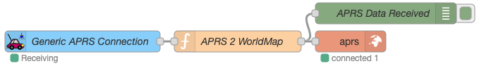
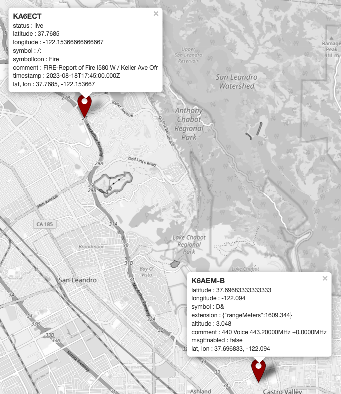
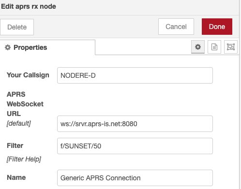
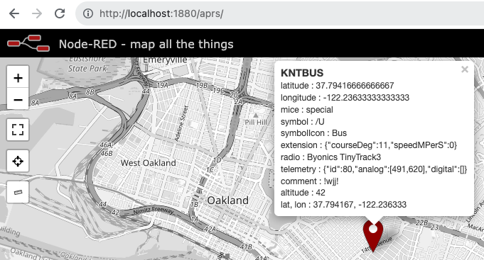
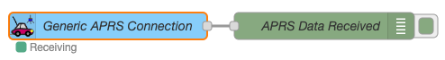
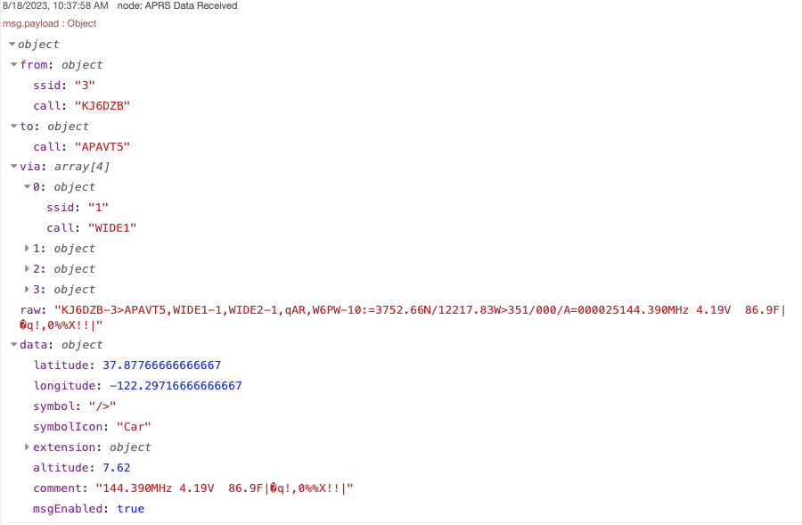
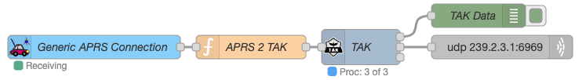
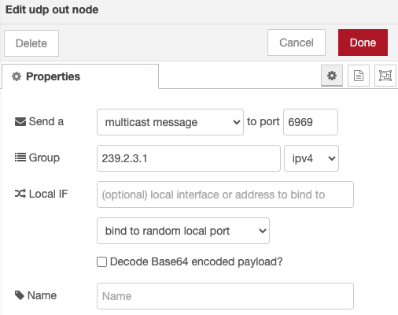
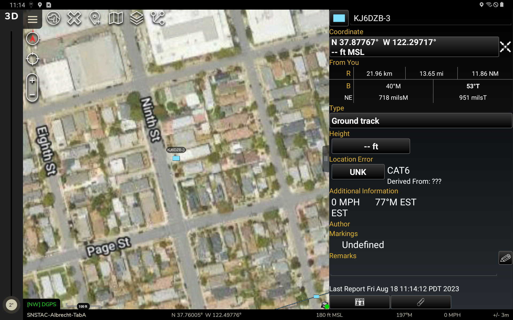

## APRS Map Example

The following example receives & decodes APRS packets from APRS-IS, and serializes 
them as Node-RED Worldmap (RedMap) JSON, for display on a local map.





### How does it work?

The **APRS RX** Node connects to the APRS-IS network via a Websocket. Once connected, it 
applies an [APRS-IS server-side filter command](https://www.aprs-is.net/javAPRSFilter.aspx) of `f/SUNSET/50`, which translates to: 

> *Only send me APRS packets  for stations that are within 50 km of SUNSET's last known position*. 



Received APRS Packets are serialized as JSON, and passed to a **Function Node**. 

```js
const pl = msg.payload;

let name = pl.from.call;

if (typeof pl.from.ssid !== "undefined" && pl.from.ssid !== null) {
    name = `${name}-${pl.from.ssid}`
}

msg.payload = {
    ...pl.data,
    "name": name,
}
```

The Function Node then serializes the data as Node-RED Worldmap (RedMap) JSON, and passes it to a **Worldmap Node**.


From there, the map is viewable in a web browser at: http://localhost:1880/aprs



### Use this example

Copy & Paste the following code block into a new Flow in Node-RED:

```js
{!examples/APRS Map Example.json!}
```

## APRS Transmit Example

The following example transmits an APRS packet into the APRS-IS network.


Clicking the Inject button will send the APRS packet to the APRS-IS network.

`W2GMD>APRSTO,TCPIP*:!3745.60N/12229.85W0 Hello World.`

### How does it work?

The **Create APRS Payload** function Node creates an APRS payload as JSON:

```js
msg.payload = {
  from: "W2GMD",
  to: "APRSTO",
  lat: "37.76",
  lon: "-122.4975",
  comment: "Hello World.",
};
```

The **aprs tx** Node serializses the JSON as an APRS Packet, authenticates with the
APRS-IS network, and sends the packet to APRS-IS.


The **aprs tx** Node uses a configuration to store APRS-IS user & pass credentials.


### Use this example

Copy & Paste the following code block into a new Flow in Node-RED:

```js
{!examples/APRS TX Example.json!}
```

## APRS Receive Example



Received APRS Frames are parsed using [aprs-parser](https://github.com/adriann0/npm-aprs-parser)
and output as `msg.payload` JSON. When used with the Debug Node, you can view deserialized APRS 
data in the Debug pane:




### Use this example

Copy & Paste the following code block into a new Flow in Node-RED:

```js
{!examples/APRS RX Example.json!}
```

## CWOP Weather Example

The following example transmits an CWOP weather report packet into the CWOP network.


Clicking the Inject button will send the CWOP packet to the CWOP network.

The **Create CWOP Payload** function Node creates an CWOP payload as JSON:

```js
msg.payload = {
  from: { call: "CALL", ssid: "6" },
  data: {
    latitude: 51.8355,
    longitude: 19.228,
    extension: { courseDeg: 239, speedMPerS: 1.543333332 },
    weather: {
      windGust: 4.4704,
      temperature: 5.555555555555555,
      rain1h: 0,
      rain24h: 2.794,
      rainSinceMidnight: 2.794,
      pressure: 996.9,
      humidity: 83,
      luminosity: 0,
    },
    comment: "Node-RED WX Station",
    timestamp: "2021-01-23T18:21:00.000Z",
  },
};
```

### Use this example

Copy & Paste the following code block into a new Flow in Node-RED:

```js
{!examples/CWOP Example.json!}
```

## APRS to TAK Gateway Example

The following example translates APRS packets into Cursor on Target packets for use 
with [TAK Products](https://tak.gov). It uses the 
[node-red-contrib-tak](https://node-red-contrib-tak.rtfd.io) Nodes, which are installed 
separately.




### How does it work?

The **APRS RX** Node connects to the APRS-IS network via a Websocket. Once connected, it 
applies an [APRS-IS server-side filter command](https://www.aprs-is.net/javAPRSFilter.aspx) of `f/SUNSET/50`, which translates to: 

> *Only send me APRS packets  for stations that are within 50 km of SUNSET's last known position*. 


Received APRS Packets are serialized as JSON, and passed to a **Function Node**. 

```js
const pl = msg.payload;

let name = pl.from.call;

if (typeof pl.from.ssid !== "undefined" && pl.from.ssid !== null) {
    name = `${name}-${pl.from.ssid}`
}

msg.payload = {
    'event': {
        '_attributes': {
            'version': '2.0',
            'time': new Date(Date.now()).toISOString(),
            'start': new Date(Date.now()).toISOString(),
            'stale': new Date(Date.now() + 500000).toISOString(),
            'type': 'a-f-G',
            'uid': name,
            'how': 'm-g',
            'access': 'Unclassified'
        },
        'point': {
            '_attributes': {
                'lat': pl.data.latitude,
                'lon': pl.data.longitude,
                'hae': "999999.0",
                'le': "999999.0",
                'ce': "999999.0",
            }
        }
    }
};
```

The Function Node then serializes the data as CoT (TAK) JSON, and passes it to a 
**TAK Node**. The TAK Node serializses the CoT JSON as CoT XML & Protobuf, and passes 
it to the **UDP Out Node**. 



The UDP Out Node sends the data to the ATAK *Mesh SA* 
multicast address of `udp://239.2.3.1:6969`, which can be picked up by any TAK client 
on the local network.



### Use this example

Copy & Paste the following code block into a new Flow in Node-RED:

```js
{!examples/TAK Example.json!}
```
