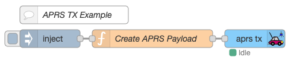
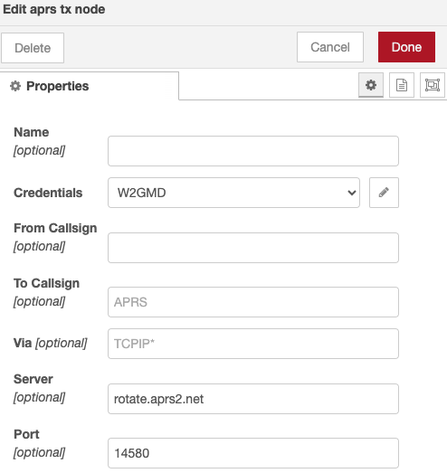
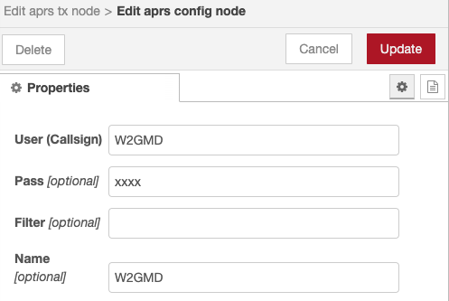
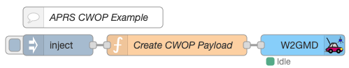

## APRS Transmit Example

The following example transmits an APRS packet into the APRS-IS network.



Clicking the Inject button will send the APRS packet to the APRS-IS network.

The **Create APRS Payload** function Node creates an APRS payload as JSON:

```js
msg.payload = {
    'from': 'W2GMD',
    'lat': '37.76',
    'lon': '-122.4975',
    'comment': 'Hello World.'
}
```

The **aprs tx** Node serializses the JSON as an APRS Packet, authenticates with the 
APRS-IS network, and sends the packet to APRS-IS.



The **aprs tx** Node uses a configuration to store APRS-IS user & pass credentials.



Copy & Paste the following code block into a new Flow in Node-RED:

```js
{!examples/APRS TX Example.json!}
```

## APRS Receive Example

Received APRS Frames are parsed using [aprs-parser](https://github.com/adriann0/npm-aprs-parser)
and output as `msg.payload` JSON. 

```js
{!examples/APRS RX Example.json!}
```

## CWOP Weather Example

The following example transmits an CWOP weather report packet into the CWOP network.



Clicking the Inject button will send the CWOP packet to the CWOP network.

The **Create CWOP Payload** function Node creates an CWOP payload as JSON:

```js
msg.payload = {
    from: { call: "CALL", ssid: "6" },
    data: {
        latitude: 51.8355,
        longitude: 19.228,
        extension: { courseDeg: 239, speedMPerS: 1.543333332 },
        weather: {
        windGust: 4.4704,
        temperature: 5.555555555555555,
        rain1h: 0,
        rain24h: 2.794,
        rainSinceMidnight: 2.794,
        pressure: 996.9,
        humidity: 83,
        luminosity: 0,
    },
    comment: "Node-RED WX Station",
    timestamp: "2021-01-23T18:21:00.000Z",
    },
};
```

Copy & Paste the following code block into a new Flow in Node-RED:

```js
{!examples/CWOP Example.json!}
```