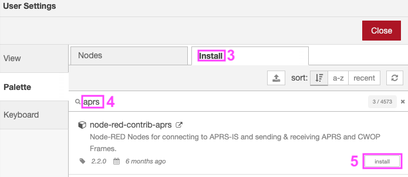
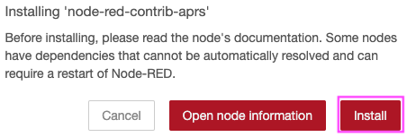
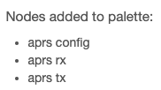
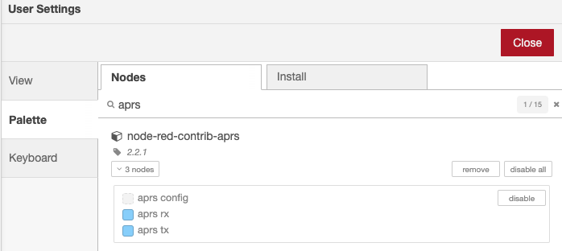
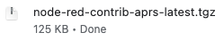
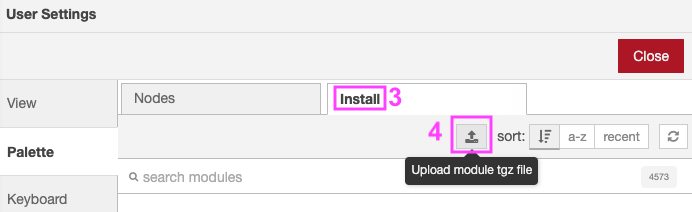
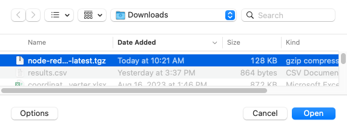
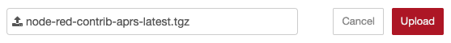

# Installation

There are **3 methods** of installing this Node, chose the method that fits your environment.

## Method A - Node-RED Palette Manager

This is most common installation method for the most common Node-RED systems.

1. Click the "hamburger" menu in the upper right.
2. Click **Manage Palette**.


<ol start=3>
  <li>Select <strong>Install</strong> tab.</li>
  <li>Enter <strong>aprs</strong> in search box.</li>
  <li>On the node-red-contrib-aprs entry, Click <strong>Install</strong> button.</li>
</ol>



Confirm installation.



After about a minute you should see a success message.



You can confirm installation by clicking the **Nodes** tab:



## Method B - Node-RED Palette Manager, with archive file.

Download an archive of [node-red-contrib-aprs](https://github.com/ampledata/node-red-contrib-aprs/releases/latest/download/node-red-contrib-aprs-latest.tgz)



1. Click the "hamburger" menu in the upper right.
2. Click **Manage Palette**.


<ol start=3>
  <li>Select <strong>Install</strong> tab.</li>
  <li>Click the <strong>Upload module tgz file</strong> button.</li>
</ol>



<ol start=6>
  <li>Locate the node-red-contrib-aprs-latest.tgz file on your system.</li>
</ol>



<ol start=5>
  <li>Select <strong>Upload</strong>.</li>
</ol>



Confirm installation.


After about a minute you should see a success message.


You can confirm installation by clicking the **Nodes** tab:


## Method C - NPM with Internet access

This method requires Internet access for the system running Node-RED and command-line (terminal, SSH or serial) access to the system running Node-RED.

Run the following command in your Node-RED user directory - typically `~/.node-red`, then restart node-red:

```bash
cd ~/.node-red
npm i node-red-contrib-aprs
node-red-admin restart
```